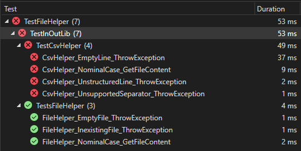
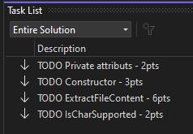

# README

## Introduction

Ce projet "FileHelper" est un projet permettant d'évaluer l'approche TDD (Test Driven Development) dans un contexte d'héritage.

|   |   |
|:--|---|
| Module  | 226b  |
| Volée | 2022-2023 - T2  |
| Classes | CA1a, SiCMi3a/b |

---

## Modalité d'évaluation

|   |   |
|:--|---|
| Temps à disposition  | 45 min  |
| IDE | Microsoft Visual Studio Enterprise 2022 (64-bit) - Current / Version 17.4.3  |
| Réseau  | Selon les consignes de l'enseignant-e (indispensable pour le premier build - nuget resolution)  |
| Mode Collaboratif  | En solo  |
| Note | NbPointsObtenus/NbPointsTotaux*5+1|
| Pondération | Vaut 1/3 de la note du module |

---

## Comment débuter ?

1.   Cloner le dépôt
2.   L'ouvrir dans Visual Studio
3.   Compiler
```
	========== Rebuild All: 2 succeeded, 0 failed, 0 skipped ==========
```

4. Etat des tests après la première compilation



5. Afficher la task list ainsi :

```
	[Menu]View->Task List
```


---

## Objectifs

Tous les tests doivent passer, tout en respectant les principes de la POO.

Rappel: Ne touchez pas les classes de tests ni l'architecture du projet!

Conseil:
* Il n'y a pas beaucoup de code à produire, favorisez la qualité !
* Si le code ne compile pas, mettez en commentaire le code qui vous bloque. Cela me permettra de valoriser votre tentative.

Bonne chance !
